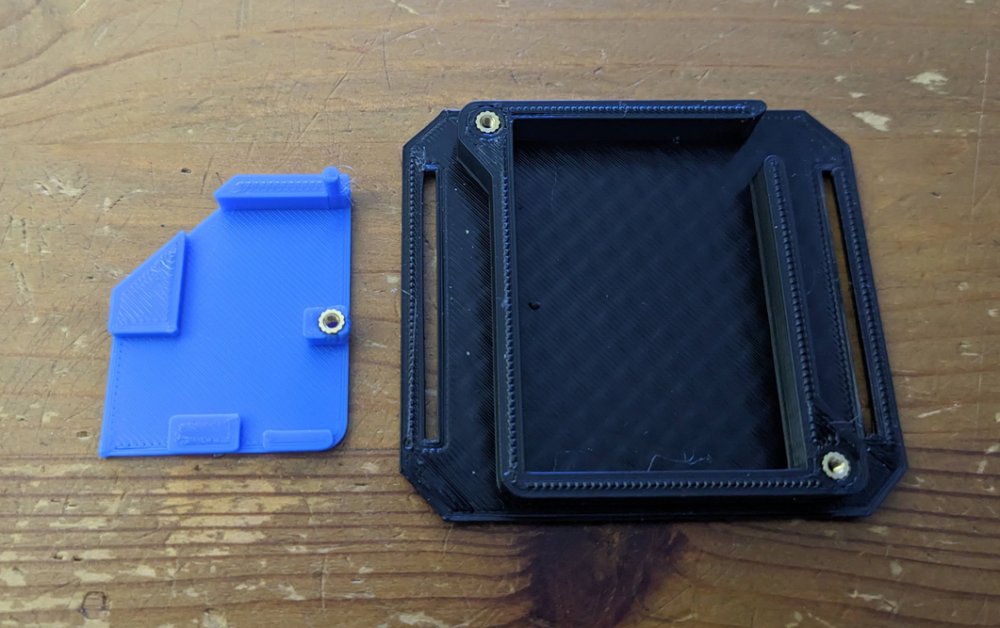
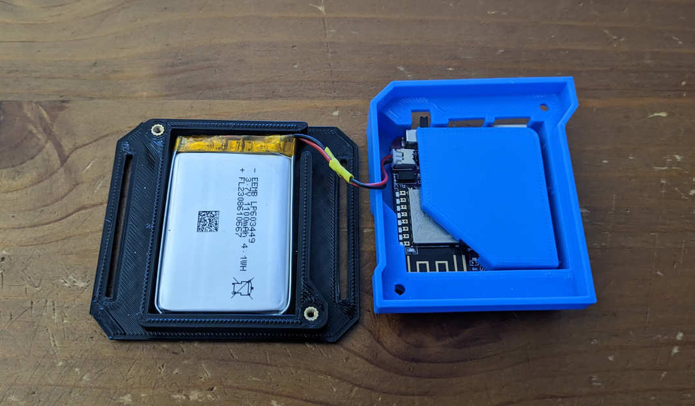
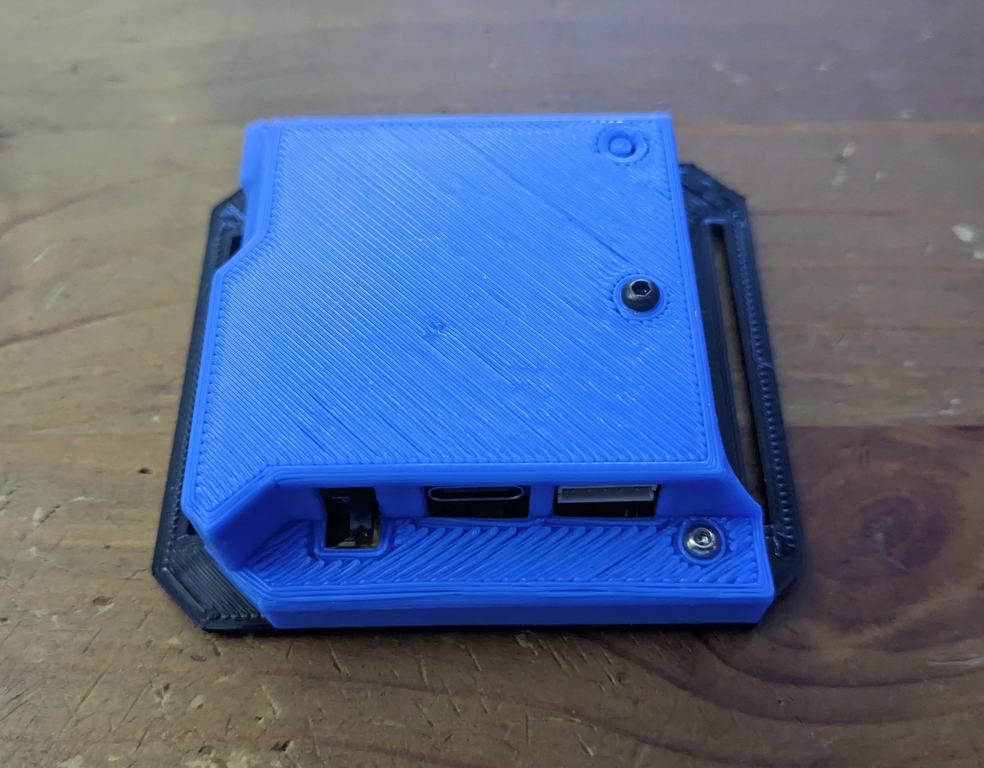
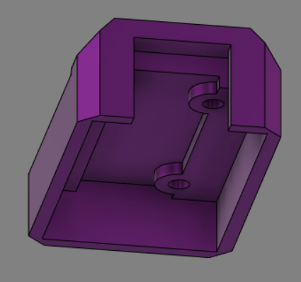
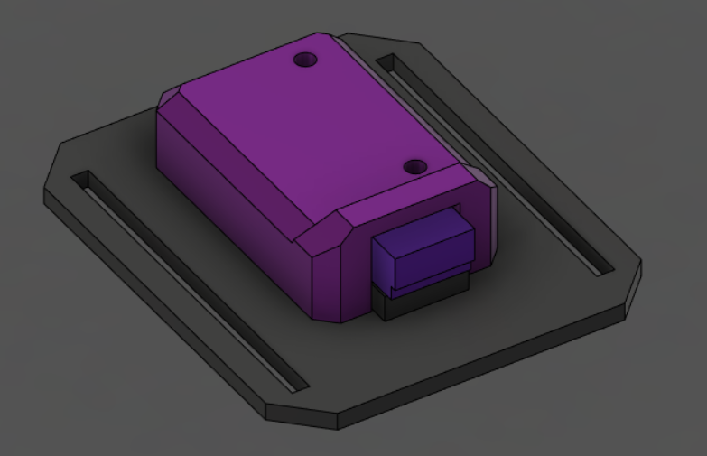

# SlimeVR-printable
3D printable enclosure for the DiY kit PCB assembly requiring minimal additional hardware.

I'm providing the Fusion 360 export f3d project file, as well as obj and stl renders of all the components in the "603449-DigitalOsmosis" directory. This is designed for the 603449 sized battery, but can be tweaked with a little effort to fit other lipo battery sizes.

If you modify the mesh files or make tweaks in Fusion 360 and are willing to contribute, please do so in a fresh subdirectory under the project root and submit a PR. Directory format should follow the syntax "{Lipo Size}-{Creator}".

## Main Enclosure

BoM:
* 3 - M2x3 threaded inserts (like [these](https://www.amazon.com/dp/B0B8GN63S2) or similar)
* 3 - M2x6 screws

The two threaded inserts in the bottom can actually be up to 6mm in the original 603449 design, but M2x3 works in all 3 places which lowers the unique part count and makes moding for a slimmer battery have one less thing to worry about. If building a version for a thinner battery (<5mm) the two M2x6 screws will need to be substituted for something a bit shorter.

Each enclosure needs 3 parts; a bottom, a spacer, and a top. After printing, insert the the 3 M2 threaded inserts as shown into the bottom and spacer. Don't overtighten this screw or it can warp the spacer causing fit problem later.

Connect the battery to the PCB, then insert the PCB into the top part, followed by the spacer. The alignment pin on the spacer should fall into the rear hole in the IMU, and the threaded insert lines up with the front hole. With an M2x6 screw from the outside screw into the threaded insert, locking the spacer and PCB in place.

The battery fits in the bottom with the cables facing the exit cutout.

**NOTE:** Battery connector in the image above was intentionally cross-wired to prevent having to repin the connector which was backwards. The positive voltage wire should be connected to the pin furthest from the on switch. There is a '+' marked on the top silksreen.

There is a bit of space in the housing to hold working slack on the battery cables, but if they are very long you may need to shorten them. If you do be careful and only cut one wire at a time, covering everything with heat shrink before cutting and soldering the other wire.

To assemble, just bring the top with the PCB installed together with the bottom holding the battery, and secure with two more M2 screws.

My full set!

## Extension Enclosure

BoM:
* 2 - M2x3 inserts (like [these](https://www.amazon.com/dp/B0B8GN63S2) or similar)
* 2 - M2x8 screws

Enclosure is super simple since there was no battery to worry about. Could have gotten away with one screw and an alignment pin, but 2 screws feels a bit more secure for something holding the case on.

Top Housing:

Bottom Housing: heat press install two M2x3 threaded inserts.

Assembled: Secure the top to the bottom, sandwiching the extension PCB, with two M2x8 screws.

